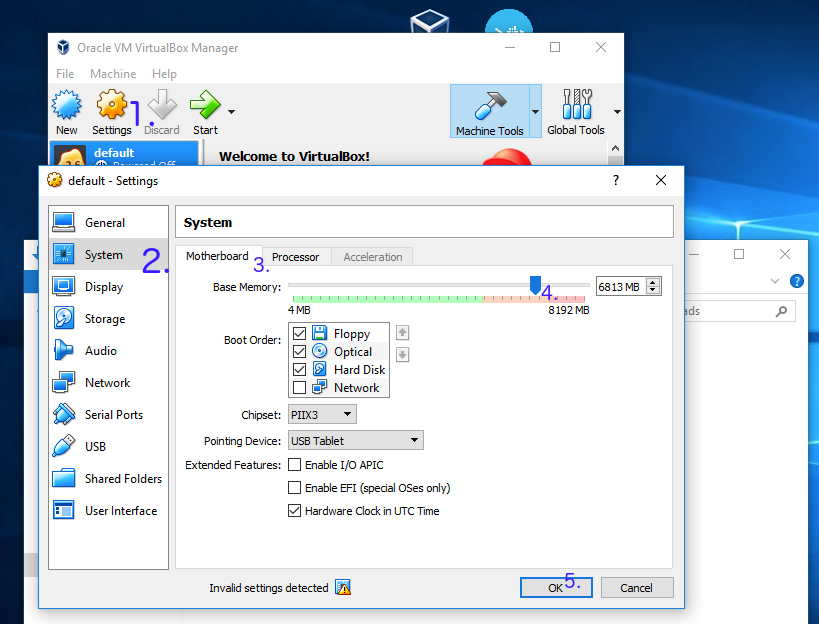

---
---
# Install Docker In Microsoft Windows

An official guide for Docker for Windows could be found [here](https://docs.docker.com/docker-for-windows/install/)

Docker for Windows requires Windows 10 Pro or Enterprise version 1586/2016 RTM.

You may only able to install [Docker Toolbox on Windows](https://docs.docker.com/toolbox/toolbox_install_windows/) instead.

Going to the instruction page, click '[Get Docker Toolbox for Windows](https://download.docker.com/win/stable/DockerToolbox.exe)', you will download a installer. You are supposed to install Docker and VirtualBox during this wizard.

Click 'Docker Quickstart Terminal', you should able to start a bash session. Close it, click virtual box. You may find there is one virtual machine is in running. Close this machine, update the maximum base memory.

Click the 'Docker Quickstart Terminal' and your docker is ready.

### FAQ

##### **Q:**  VirtualBox won't boot a 64bits VM when Hyper-V is activated

You may meet message as follow:

> Error with pre-create check: "This computer is running Hyper-V. VirtualBox won't boot a 64bits VM when Hyper-V is activated.
> Either use Hyper-V as a driver, or disable the Hyper-V hypervisor. (To skip this check, use --virtualbox-no-vtx-check)

You can’t run VirtualBox on a Hyper-V enabled system. Hyper-V is a tier-1 hypervisor, which doesn’t accept other hypervisors (from [here](https://forums.docker.com/t/unable-to-run-the-docker-toolbox/37403/3))

1. It seems like Docker for Windows has already resolved this issue
2. Try to [disable Hyper-V](https://superuser.com/questions/540055/convenient-way-to-enable-disable-hyper-v-in-windows-8). **Caution:** According to some reports, this operation may damage his/her network and had to reinstall all network adapters to get Internet back, or even getting a blue screen error.
3. Try to use hyperv as your backend driver. [https://docs.docker.com/machine/drivers/hyper-v/](https://docs.docker.com/machine/drivers/hyper-v/)
